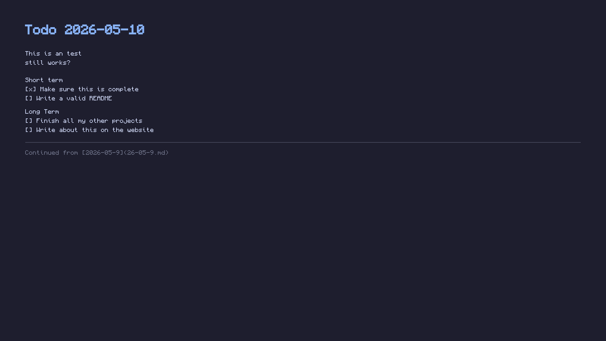

# Ink

A daily todo script that opens a dated markdown file in your terminal editor and renders it as your GNOME wallpaper on save.


## What it does

- Running `ink` opens `logs/YY-MM-DD.md` in your `$EDITOR`
- If today's file doesn't exist, it copies yesterday's content and appends a link back to it
- When you exit the editor, the markdown is rendered into a 1920×1080 image (Monocraft font, dark theme) and set as your GNOME desktop background

## Setup

Make it available system-wide:

```bash
sudo ln -s /path/to/background-to-do/ink /usr/local/bin/ink
```

Make sure your editor is set (add to `~/.bashrc` or `~/.zshrc` if not already):

```bash
export EDITOR=nvim
```

## Dependencies

- `python3` (stdlib only)
- `magick` (ImageMagick 7+)
- `gsettings` (part of GNOME)
